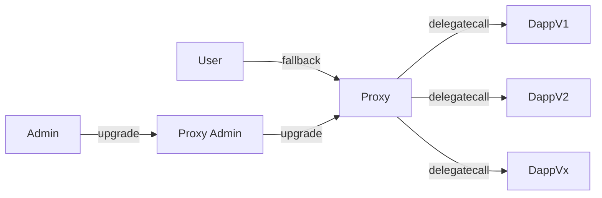

# 链上部署信息
## B² Haven Testnet
https://haven-explorer.bsquared.network/
## 测试环境
---
| contract                                 | Address                                    |
|------------------------------------------| ------------------------------------------ |
| locker(proxy)                    | 0xA40A5da41EeEC122D0Fff780194733a9D1a6F298 |
| MyToken(MTK)                   | 0xe652eBb0E8e6BDe4CC99895586F5bE88e7D9CC17 |
| locker(admin)                   | 0x452B8D18f8dA5BCa34FBEaEDa748c86aC8A86FA2 |
| locker(logic)                   | 0x5cD1c6D15ab1d6a93e77aA4A25f193E3cd936786 |
## 生产环境
---
| contract                                 | Address                                    |
|------------------------------------------| ------------------------------------------ |
| locker(proxy)                    | 0x8D54165232456fBb90D2ddAA977C14A20452222f |
| BlockHeadz(BHT)                   | 0x1f5222537DfCd67F74d18651601119f29e1e5F12 |
| locker(admin)                   | 0x35b32B1Bb9968Bef86Bc32Cf2c19e4ED2c021b93 |
| locker(logic)                   | 0x279F261d6563F6fed500BCDf7Ce3990D71cA2ab2 |

# 架构设计


# 使用说明
1. Locker合约功能依赖于基于ERC-721协议开发的智能合约:`Locker`和`testERC721`
    1. `Locker`即锁定合约,NFT锁定相关功能在此实现
    2. `testERC721`即一个基于ERC721协议实现的的NFT合约
2. 上述合约均部署成功后，还需做以下准备工作
    1. 初始化`Locker`合约,需调用`setInitialData()`,传入nft代币地址和链下签名signer地址
    2. 由于需要保证`Locker`合约有权限转移和锁定`testERC721`合约中的NFT,因此需要持有`testERC721`的用户事先调用`testERC721`中的`setApprovalForAll()`或者`approve()`方法从而赋予`Locker`操作NFT的权限
3. 前面的操作完成后,用户即可开始与`Locker`合约交互
4. `Locker`合约若有bug修复、新增接口或功能等需求可通过升级功能实现

# 程序设计
## 主要函数
1. `initialize()`初始化owner信息(仅能调用一次),在部署可升级合约proxy时会通过函数选择器调用
2. `setInitialData()`初始化`collection`和`signer`,仅可调用一次（仅owner可用）
3. `lock()`锁定nft的操作
4. `unLock()`解锁nft的操作,需要后端提供有效的授权签名
5. `updateSigner()`更新新的`signer`（仅owner可用）
## 事件
1. `event lockEvent(address indexed l2Address, string indexed l1Address, uint256 indexed tokenId, uint256 nonce)`
2. `event unLockEvent(address indexed l2Address, string indexed l1Address, uint256 indexed tokenId, uint256 nonce)`

# 可升级合约(透明代理)
## 部署步骤
1. 实现可升级功能需要部署三个合约
    1. `Locker`合约,这是实现锁定功能的逻辑合约`logic contract`
    2. `ProxyAdmin`合约,这是用于升级、管理代理合约和逻辑合约的管理员合约`addmin contract`
    3. `TransparentUpgradeableProxy`合约,它利用`delegatecall`调用逻辑合约功能，但状态却存储至本合约之中,代理合约`proxy contract`
2. 需要依次部署`logic contract`,`addmin contract`,`proxy contract`(代理合约部署时需要传入前两个合约的合约地址作为参数，还有一个初始化数据，用于在部署时初始化合约状态的参数)
3. 部署上述三个合约成功后，我们就可以通过调用proxy合约中的方法实现这种代理模式
    1. 在使用js/ts调用proxy时，需要先获取其实例,才能通过调用`proxy contract`使用`logic contract`中的方法
    ```typescript
        const tmp = fs.readFileSync(`artifacts/contracts/LockerV1/LockerV1.sol/LockerV1.json`, 'utf-8');
        const artifactV1 = JSON.parse(tmp);
        contractInstanceV1 = new ethers.Contract(proxyAddress, artifactV1.abi, owner);
    ```
    2. 获取合约实例后，我们就可以正常使用`logic contract`中的方法
    ```typescript
        await contractInstanceV1.lock(tokenId, signature);
    ```
## 合约升级
1. 若合约需要进行功能改进或bug修复，我们就需要用到合约升级功能
2. 将新的`logicV2 contract`部署链上，获取其合约地址
3. 调用`admin contrat`中的`upgrade()`就可以完成升级了
    ```typescript
        await admin.upgrade(proxyAddress, logicV2Address); // 升级合约

        const tmp = fs.readFileSync(`artifacts/contracts/LockerV2/LokcerV2.sol/LockerV2.json`, 'utf-8');
        const artifactV2 = JSON.parse(tmp);
        contractInstanceV2 = new ethers.Contract(proxyAddress, artifactV2.abi, owner);
        await contractInstanceV2.lock(tokenId, signature);
    ```
4. 升级之后再调用proxy执行的逻辑就遵循`logicV2 contract`,同时从前在`logicV1 contract`执行后保存的状态依旧会得到保留和继承


# 单元测试
```bash
  locker
    setInitialData
      ✔ should allow owner setInitialData
      ✔ reverts when owner tries to setInitialData again
      ✔ reverts when non-owner tries to setInitialData
    lock
      ✔ should allow user lock token
      ✔ reverts when user tries to lock token does not belong him
      ✔ reverts when user tries to lock token does not exist
      ✔ reverts when user tries to lock the same token twice
    unlock
      ✔ should allow user unlock token use right signature
      ✔ reverts when user tries to unlock token with incorrect signature
      ✔ reverts when user tries to unlock token does not belong him
    undateSigner
      ✔ should allow owner updateSigner
      ✔ reverts when user tries to undateSigner
    transferOwnership
      ✔ should allow owner transferOwnership
      ✔ reverts when user tries to transferOwnership

  14 passing (1s)
```


## Polygon Zkevm Testnet
https://testnet-zkevm.polygonscan.com/

---

| contract                                 | Address                                    |
|------------------------------------------| ------------------------------------------ |
| locker                    | 0x82ed7A245C0c290131621BCcDdb9C69792A23056 |
| testERC721                   | 0xF7e797AB072C9EBaC01bc8df3f5AA9a815b76D75 |